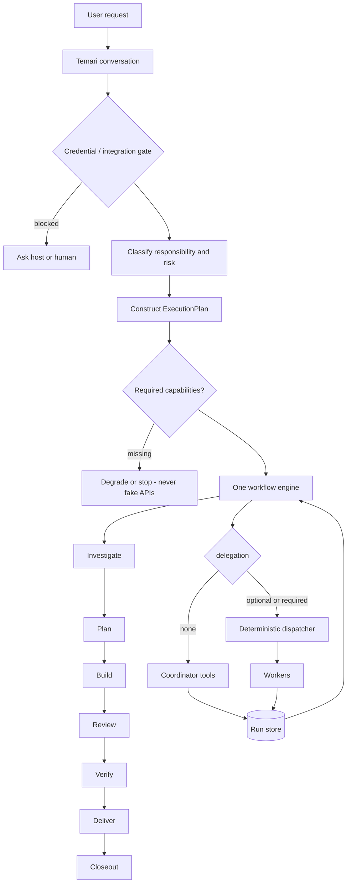

# Workflow

```mermaid
flowchart TD
  U[User request] --> T[Temari conversation]
  T --> G{Credential / integration gate}
  G -->|blocked| H[Ask host or human]
  G --> C[Classify responsibility and risk]
  C --> P[Construct ExecutionPlan]
  P --> Cap{Required capabilities?}
  Cap -->|missing| Deg[Degrade or stop - never fake APIs]
  Cap --> E[One workflow engine]
  E --> I[Investigate]
  I --> Pl[Plan]
  Pl --> B[Build]
  B --> R[Review]
  R --> V[Verify]
  V --> D[Deliver]
  D --> X[Closeout]
  E --> Exec{delegation}
  Exec -->|none| Local[Coordinator tools]
  Exec -->|optional or required| Disp[Deterministic dispatcher]
  Disp --> W[Workers]
  Local --> Store[(Run store)]
  W --> Store
  Store --> E
```
